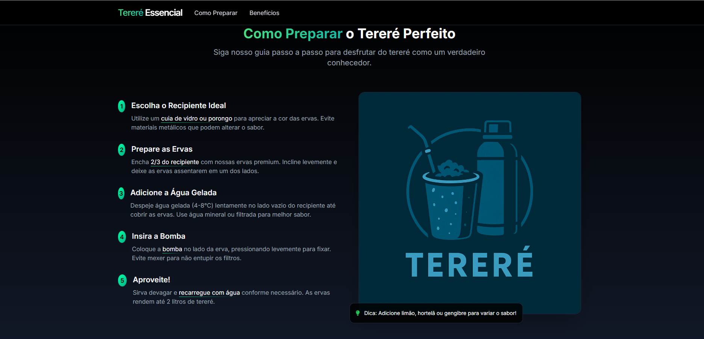

# 🌿 Tereré Essencial

**Tereré Essencial** é uma landing page moderna e responsiva criada para apresentar os benefícios, o preparo e os produtos relacionados ao tereré — uma bebida refrescante, natural e cheia de tradição.

## 🖼️ Preview



---

## 🚀 Funcionalidades

- ✅ Design moderno com Tailwind CSS
- ✅ Mobile first com menu responsivo
- ✅ Seção de Benefícios com ícones visuais
- ✅ Guia passo a passo para preparar o tereré
- ✅ Acordeão de FAQ com animações suaves
- ✅ Toast de notificação simulando ações
- ✅ Scroll suave para navegação fluida

---

## 📁 Estrutura do Projeto

```
📁 projeto/
├── index.html             # Página principal
├── styles.css             # Estilos personalizados
├── script.js              # Funcionalidades com JS puro
└── assets/                # (opcional) Imagens, ícones etc.
```

---

## 🛠️ Tecnologias Utilizadas

- [HTML5](https://developer.mozilla.org/pt-BR/docs/Web/HTML)
- [Tailwind CSS](https://tailwindcss.com/) (via CDN)
- [Font Awesome](https://fontawesome.com/) para ícones
- [JavaScript Vanilla](https://developer.mozilla.org/pt-BR/docs/Web/JavaScript)

---

## 📦 Como usar localmente

1. Clone este repositório:
   ```bash
   git clone https://github.com/seu-usuario/terere-essencial.git
   ```

2. Acesse a pasta:
   ```bash
   cd terere-essencial
   ```

3. Abra o arquivo `index.html` no seu navegador:
   - Clique duas vezes ou use extensão Live Server no VS Code.

---

## ✨ Melhorias Futuras

- Integração com API de produtos
- Sistema de carrinho funcional
- Formulário de contato ou assinatura
- Deploy em Vercel, Netlify ou GitHub Pages

---

## 📄 Licença

Este projeto está licenciado sob a [MIT License](LICENSE).

---

## 🤝 Contribuição

Contribuições são bem-vindas! Fique à vontade para abrir issues ou enviar pull requests.


